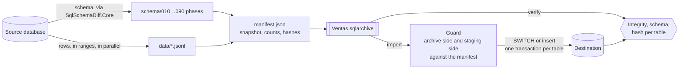

<div align="center">

# 🗃️ SqlArchive

**Export a SQL Server database to a readable archive. Restore it somewhere else. Prove they match.**

[](https://github.com/peopleworks/SqlArchive/actions/workflows/ci.yml)
[](https://dotnet.microsoft.com/)
[](https://www.microsoft.com/sql-server)
[](#what-works-today)
[](LICENSE)
[](https://mvp.microsoft.com/en-US/mvp/profile/24060a02-dbc6-44ec-bca5-c213ff9835c5)

[](https://github.com/peopleworks/SqlArchive/releases/latest)
[](https://www.nuget.org/packages/PeopleWorks.SqlArchive.Cli)

**[📖 Pocket guide — every command on one page](https://peopleworks.github.io/SqlArchive/)**


<sub>A thousand modified rows are still a thousand rows. The per-table hash is what sees them.</sub>

</div>

---

## What works today

SqlArchive **0.1.0** is on nuget.org, and all four verbs work. The round trip — export a
database, restore it into an empty one, verify the two match with no differences at all —
runs against a real SQL Server in CI and by hand before every release.

| Verb | Today |
|---|---|
| **`export`** | Reads a database into an archive: table globs, `--where` per table, parallel reads split into ranges, a resumable spool, three consistency modes, and a hash per table. |
| **`import`** | Restores it. Empty destination: the archive's own phases around the data. Destination that already holds tables: a schema diff first, and each table published through staging with an exact guard. `--schema-only` and `--data-only` do the halves. |
| **`verify`** | Answers three questions from one manifest: is the archive intact (no server touched), does a restored database match it, has a live database drifted from it. Says *which* table differs and whether by schema, by count, or by content at the same count. |
| **`inspect`** | Reads the manifest and the entry list without unpacking a byte, on our archives and on [dbdumper](https://github.com/JeePeeTee/dbdumper)'s. |

The part everything hangs off is **the format**, in
[`PeopleWorks.SqlArchive.Core`](src/SqlArchive.Core) — the manifest, the phased schema,
the JSONL encoding, the value-encoding table that defines equality, the row hash, and
the reader for dbdumper's manifest. [`FORMAT.md`](FORMAT.md) is its normative
specification and [`DESIGN.md`](DESIGN.md) says why each decision went the way it did.

### A system-versioned table comes back with its timeline

A temporal table is archived **with its history**, and a restored one answers
`FOR SYSTEM_TIME AS OF` exactly as the source did — at every instant, including the one
most restores get wrong: the stretch between the last change and the moment of the restore,
where a naive copy has stamped every current row with the time it was loaded and so answers
nothing at all. The period columns travel as data, the history table travels as a table of
its own, and the period is put back on the rows *after* they are loaded, which is the only
order SQL Server accepts that keeps them. `verify` compares the history like any other table.

If the history is the reason you are archiving the database, this is what it is for.

### What it does not carry, and says so here rather than letting you find out

- **Users, roles, permissions and extended properties.** The schema side is SQLDiff's
  snapshot, and they are not in it yet. If they are the point, `BACKUP` is the better tool —
  see [How it compares](#how-it-compares).
- **A memory-optimized table cannot be restored into a fresh database**: its
  `MEMORY_OPTIMIZED_DATA` filegroup is not in the snapshot, so the table phase fails. Add the
  filegroup to the destination first.
- **Restoring over a database that already has tables drops nothing.** A column, an index or
  a table the destination has and the archive does not is left where it is, and a `verify`
  afterwards names it. For an exact copy, restore into an empty database.
- **On that route, a table that cannot be switched is published by `DELETE` and `INSERT`** —
  one whose foreign keys are switched off for the data phase, or a system-versioned one — so
  the destination's triggers on it fire.
- **`--table` and `--exclude` on `import` select rows, not schema.** The schema phases are
  the archive's own files and run whole, so an excluded table is still created and left
  empty. The summary says so per table.
- **A restored identity continues from the highest id in the current rows**, not from the
  source's counter. An id that exists only in a temporal table's history — a row that was
  deleted — can therefore be handed out again.
- **`rowversion` and computed columns are not carried as data**: SQL Server generates those
  values and refuses to be told what they are. The columns come back; their values are the
  destination's own.
- The verdict says *which table* changed, never which row — the trade `DESIGN.md` makes for
  a manifest that costs bytes per table instead of as much as the data.
- **Connection strings are command-line arguments only** in 0.1.0 — see
  [Connection strings](#connection-strings).

---

## What it actually does

A small database, `Ventas`: 1,200 customers, 8,500 orders with a foreign key to them, and a
system-versioned price table with two rows of history. Every block below is the real output
of the command above it, run against SQL Server 2025 while this README was being written.

```bash
VENTAS="Server=.;Database=Ventas;Integrated Security=true;TrustServerCertificate=true"
COPIA="Server=.;Database=VentasCopia;Integrated Security=true;TrustServerCertificate=true"
```

**1. Export it.**

```bash
sqlarchive export --source "$VENTAS" --out Ventas.sqlarchive
```

```console
── Ventas.sqlarchive ───────────────────────────────────────────────────────────
Tables        4 tables
Rows          9,705
Consistency   per-table - each table read on its own, no shared instant
File          114.5 KB at Ventas.sqlarchive
Elapsed       0:02
- [dbo].[PrecioHistoria] is the history of [dbo].[Precio] and is archived as a
table of its own, rows and all, so a restore hands versioning a history that
answers FOR SYSTEM_TIME the way the source did.
```

**2. Restore it into a database that exists and is empty.**

```bash
sqlcmd -S . -E -C -Q "CREATE DATABASE VentasCopia"
sqlarchive import Ventas.sqlarchive --destination "$COPIA"
```

```console
── VentasCopia on . ────────────────────────────────────────────────────────────
Archive   Ventas.sqlarchive - Ventas on PeopleWorksAI
Mode      migration - the destination is diffed against the archive and altered
          where that preserves rows
Schema    44 statements run
Rows      9,705
Elapsed   00:00:02
╭────────────────────────┬───────┬──────┬───────────╮
│ Table                  │  Rows │ How  │           │
├────────────────────────┼───────┼──────┼───────────┤
│ [dbo].[Cliente]        │ 1,200 │ swap │ published │
│ [dbo].[Precio]         │     3 │ swap │ published │
│ [dbo].[PrecioHistoria] │     2 │ swap │ published │
│ [ventas].[Pedido]      │ 8,500 │ swap │ published │
╰────────────────────────┴───────┴──────┴───────────╯
- The destination holds no tables, so the archive's own schema phases are run
around the data - bare tables, then the rows, then the keys, indexes and foreign
keys. That is the shape the archive was written for, and it is why a restore
needs no load order: the foreign keys are not there while the tables are being
filled.
Restored. 4 tables published, 0 tables not - each with its reason above.
```

The `Mode` line says *migration* on this route too — a wording slip in 0.1.0, fixed for the
next release, where it reads *schema and rows*. The notice under the table names the route
that actually ran.

**3. Prove the copy is the archive.** Exit code `0`.

```bash
sqlarchive verify Ventas.sqlarchive --against "$COPIA"
```

```console
Integrity  16 entries intact

Schema  the two describe the same objects

╭────────────────────────┬─────────┬───────┬─────────────╮
│ Table                  │ Verdict │  Rows │ Content     │
├────────────────────────┼─────────┼───────┼─────────────┤
│ [dbo].[Cliente]        │ matches │ 1,200 │ 8a4617bb... │
│ [dbo].[Precio]         │ matches │     3 │ 226d7abe... │
│ [dbo].[PrecioHistoria] │ matches │     2 │ 0b72d44f... │
│ [ventas].[Pedido]      │ matches │ 8,500 │ 6cac98e8... │
╰────────────────────────┴─────────┴───────┴─────────────╯
4 tables match

No differences. VentasCopia is what this archive says it is.
```

**4. Change the copy the way real databases change**, and ask again:

```sql
UPDATE dbo.Cliente SET Email = LOWER(Email) + '.mx' WHERE Id % 40 = 0;  -- 30 rows
DELETE FROM ventas.Pedido WHERE Id > 8490;                               -- 10 rows
ALTER TABLE dbo.Cliente ADD Telefono varchar(20) NULL;
```

```bash
sqlarchive verify Ventas.sqlarchive --against "$COPIA" --json drift.json
```

```console
── Ventas.sqlarchive ───────────────────────────────────────────────────────────

Archive         Ventas.sqlarchive
Compared with   VentasCopia
Took            0.4 s

Integrity  16 entries intact

Schema
        1 object different on the two sides: [dbo].[Cliente]
        not compared: The name of the database. An archive of one database
        restored into another with a different name is a correct restore, not
        drift.

╭───────────────────────┬──────────┬───────────────┬───────────────────────────╮
│ Table                 │ Verdict  │          Rows │ Content                   │
├───────────────────────┼──────────┼───────────────┼───────────────────────────┤
│ [dbo].[Cliente]       │ schema   │         1,200 │ 8a4617bb... ->            │
│                       │          │               │ 61d73c51...               │
│ [dbo].[Precio]        │ matches  │             3 │ 226d7abe...               │
│ [dbo].[               │ matches  │             2 │ 0b72d44f...               │
│ PrecioHistoria]       │          │               │                           │
│ [ventas].[Pedido]     │ row      │     8,500 ->  │ 6cac98e8... ->            │
│                       │ count    │         8,490 │ 32922344...               │
╰───────────────────────┴──────────┴───────────────┴───────────────────────────╯
2 tables match, 2 tables differ

[dbo].[Cliente]    the database has a column the archive does not: [Telefono]
                   varchar(20).
                   1,200 rows on both sides, and the content differs.
[ventas].[Pedido]  the archive declares 8,500 rows and the database holds 8,490.

Differences found. This run did what it was asked and the two sides do not
match, so it returns 3 rather than 1, which is what a run that could not make
the comparison returns.
The same verdict, as JSON, is in drift.json.
```

Four things worth noticing:

1. **`[dbo].[Cliente]` has 1,200 rows on both sides.** A row count would call it a match.
   The content hash moved from `8a4617bb…` to `61d73c51…`, and the detail says it in words:
   *1,200 rows on both sides, and the content differs.* The verdict column shows `schema`
   because that is the larger of the two differences; the detail lists both.
2. **Integrity comes first.** The 16 entries hash to what the manifest declares before any
   table is compared, so a difference is in the database, not in a damaged file.
3. **The history came along and still matches.** `[dbo].[PrecioHistoria]` was archived as a
   table of its own — export said so — and restored with the timeline intact.
4. **It exits `3`, not `1`.** The comparison ran and found differences. `1` is kept for
   *could not compare* — a corrupt archive, an unreachable server — which a nightly job has
   to handle differently.

---

## What it is

The fourth tool in the PeopleWorks database family.
[SQLDiff](https://github.com/peopleworks/SqlSchemaDiff) moves schema and
[SyncJob](https://github.com/peopleworks/syncjob) moves data; SqlArchive moves a whole
database, through a file you can read, compare and verify.

It carries no engine of its own. It composes two published packages:

| Package | What it brings |
|---|---|
| [`PeopleWorks.SqlSchemaDiff.Core`](https://www.nuget.org/packages/PeopleWorks.SqlSchemaDiff.Core) | Extract, compare and compose schema. Data-preserving `ALTER`. |
| [`PeopleWorks.SyncJob.Core`](https://www.nuget.org/packages/PeopleWorks.SyncJob.Core) | Staging, the row guard, publication by swap. |

A defect in either is fixed in that package, not worked around by copying its code here.

## Install

**As a .NET tool:**

```bash
dotnet tool install -g PeopleWorks.SqlArchive.Cli
sqlarchive --version
```

**Or the single executable.** Each [release](https://github.com/peopleworks/SqlArchive/releases/latest)
attaches `sqlarchive-win-x64.zip`: one self-contained `sqlarchive.exe`, no .NET runtime to
install. Unzip it and run it.

**Or build from source** — .NET 9 SDK, nothing else:

```bash
git clone https://github.com/peopleworks/SqlArchive.git
cd SqlArchive
dotnet build SqlArchive.sln -c Release
dotnet run --project src/SqlArchive.Cli -- inspect Ventas.sqlarchive
```

**Or use the engine as a library.** [`PeopleWorks.SqlArchive.Core`](https://www.nuget.org/packages/PeopleWorks.SqlArchive.Core)
is published beside the CLI, which is a thin layer over it. [`FORMAT.md`](FORMAT.md) is the
contract it implements, and package validation holds its public API to the last release's.

```bash
dotnet add package PeopleWorks.SqlArchive.Core
```

SQL Server 2016 or newer on both sides. `import` runs DDL, so its login must be able to
create and alter tables in the destination; `verify` and `inspect` only read.

---

## The commands

| Command | What it does |
|---|---|
| `export` | Read a database into an archive: the schema, the rows, and a hash of each table. |
| `import` | Restore an archive — into an empty database, or as a migration over one that already has tables. |
| `verify` | Prove an archive is intact, or that a database still matches it down to the row. **Exits `3`** when it does not. |
| `inspect` | Show what an archive holds, without unpacking a byte. |

`sqlarchive <command> --help` lists every option, with the reason behind each default.

### The usual sequence

```bash
# 1. Take the archive. --consistent reads every table at one instant, or refuses.
sqlarchive export --source "$PROD" --out Ventas.sqlarchive --consistent

# 2. Look at what you took: filters, rows left out and history tables are named here.
sqlarchive inspect Ventas.sqlarchive

# 3. Check the file before trusting it. No server is involved.
sqlarchive verify Ventas.sqlarchive

# 4. See what a restore would do, then do it. The destination database must exist.
sqlarchive import Ventas.sqlarchive --destination "$TEST" --dry-run
sqlarchive import Ventas.sqlarchive --destination "$TEST"

# 5. Prove the restore.
sqlarchive verify Ventas.sqlarchive --against "$TEST"
```

## `export`

Reads the schema through SqlSchemaDiff.Core — the same extraction `sqldiff extract` does —
and every table as JSONL, hashing each line on its way into the file.

| Option | |
|---|---|
| `-s, --source <CONNECTION>` | The database to archive. |
| `-o, --out <FILE>` | The archive to write. `.sqlarchive` by convention; not enforced. |
| `--table <GLOB>`, `--exclude <GLOB>` | Which tables, as `schema.table`. Repeatable; `--exclude` applies after `--table`. |
| `--where <TABLE=PREDICATE>` | Only the rows of one table that match, as `dbo.Order=Total>0`. Repeatable. |
| `--schema-only` | The schema and none of the rows. |
| `--consistent` | Every table read at one instant — or a refusal. |
| `--maxdop <N>` | Units read at once. Default: the processor count, capped at 8. |
| `--range-size <ROWS>` | Split large tables into range files of about this many rows, so one table can use every reader. |
| `--spool <DIR>`, `--resume` | Where the partial export is kept (default: beside `--out`), and carrying on after an interruption. |

**Consistency is a mode, and the manifest records which one was used.** By default each
table is read on its own, so two tables need not be the same instant — fine for a database
nobody is writing to, wrong for one that is live. `--consistent` tries a database snapshot
first, which keeps the parallel reads, then a single connection under `SNAPSHOT` isolation,
which costs them. If neither is available it **refuses** and says which permission or
setting is missing. It does not fall back to reading table by table: an archive that was
asked to be consistent and quietly is not is worse than a failed export.

```console
Consistency   snapshot - every table read from the same instant
```

**A partial archive says so.** `--where` is written into the manifest as that table's
`rowFilter`, and `--schema-only` marks every table `dataSkipped`, so a later `verify` knows
the missing rows are absent on purpose and does not report them as drift.

**Large tables are read in ranges.** `--range-size` cuts a table on a numeric or date key
that heads an index and is `NOT NULL` — a nullable key would drop its null rows out of every
range at once, and the total would still look plausible. A table without such a key is read
whole. The spool carries a fingerprint of the connection, the filters and the format
version, so `--resume` with different ones is refused rather than mixing two runs into one
archive.

## `import`

`import` reads the destination before it writes anything, and picks one of two routes. The
destination database must exist — `CREATE DATABASE` first.

**Into an empty database**, the archive's own schema phases run around the data: bare
tables, then the rows, then keys, indexes and foreign keys. No load order is needed, because
the foreign keys are not there while the tables fill. Each table is published by `SWITCH`
from a staging table.

**Into a database that already has tables**, it is a migration, not a drop. The
destination's schema is diffed against the archive's and altered where that keeps rows;
nothing is dropped. Then each table is replaced whole, in a transaction of its own.
`--dry-run` makes the diff for real and writes nothing:

```console
── dry run - what restoring into VentasCopia on . would do ─────────────────────

Schema    8 statements to run

╭────────────────────────┬───────┬─────┬────────────────────╮
│ Table                  │  Rows │ How │                    │
├────────────────────────┼───────┼─────┼────────────────────┤
│ [dbo].[Cliente]        │ 1,200 │     │ would be published │
│ [dbo].[Precio]         │     3 │     │ would be published │
│ [dbo].[PrecioHistoria] │     2 │     │ would be published │
│ [ventas].[Pedido]      │ 8,500 │     │ would be published │
╰────────────────────────┴───────┴─────┴────────────────────╯

- The destination already holds 3 tables, so this is a migration: 0 object(s)
created, 1 altered, and nothing dropped. Objects the destination has and the
archive does not are left alone.
- 1 foreign key of the destination would be switched off for the data phase and
put back afterwards: every table here is replaced whole, and SQL Server refuses
to empty a table another key points at whichever way you empty it. They are
re-validated on the way back, which is the first moment at which validating them
means anything - the rows on both sides are the archive's.

Nothing was written. 4 tables would be published; the schema comparison above
was made against the destination as it is now.
```

That dry run was against the drifted copy from [step 4 above](#what-it-actually-does). The
real import put the 30 emails and the 10 orders back — and left `Telefono` where it was,
because the archive does not have it and nothing is dropped. A `verify` straight afterwards
exits `3` and names that one column.

| Option | |
|---|---|
| `<ARCHIVE>` | The archive to restore. |
| `-d, --destination <CONNECTION>` | The database to restore into. It does not have to be empty or new; it has to exist. |
| `--dry-run` | Say what would be altered and published, and write nothing. |
| `--schema-only`, `--data-only` | Only the schema phases; or only the rows, into a destination that already has the right shape — refused where it does not. |
| `--table <GLOB>`, `--exclude <GLOB>` | Which tables' **rows** to publish. The schema phases still run whole. |
| `--continue-on-error` | Carry on when a table fails. The ones that succeeded stay published; the one that failed is untouched, not half loaded. |
| `--maxdop <N>` | Tables staged at once. Default: the processor count, capped at 8. |
| `--resume`, `--work-dir <DIR>` | Carry on an interrupted restore with the tables still missing. The journal holds no rows, only which tables are done. |

**Every table passes the same guard.** The manifest says how many rows a table has and what
they hash to. The rows read out of the archive have to match it, and so — read back through
the same encoder — do the rows that landed in staging. A truncated archive, a damaged entry
or a load that silently dropped rows stops that table before it is published.

## `verify`

Three questions, one manifest:

| You run | It answers | Server |
|---|---|---|
| `verify Ventas.sqlarchive` | Is this file still what it says it is? Every entry against the hash the manifest declares. | None touched |
| `verify Ventas.sqlarchive --against "$COPY"` | Does this restore match the archive — schema, row counts, content? | Read only |
| `verify Ventas.sqlarchive --against "$PROD" --table "cfg.*"` | Has a live database drifted from it? | Read only |

Each table gets one verdict: it **matches**; its **schema** differs; its **row count**
differs; its **content** differs at the same row count — the case a count cannot see; it is
**missing** from one side; it is **not verifiable**, because its rows were deliberately not
archived or the archive carries no hash for them; or it was **not compared**, left out by a
glob or `--schema-only`. The name of the database is deliberately not compared: a restore
under another name is a correct restore.

| Option | |
|---|---|
| `<ARCHIVE>` | The archive — the side of the comparison that is a file. |
| `-a, --against <CONNECTION>` | Compare with a live database. Without it, only the archive's own integrity is checked. |
| `--table <GLOB>`, `--exclude <GLOB>` | Which tables, as `schema.table`. Repeatable. |
| `--schema-only` | Compare the schema and stop; no table is read on either side. |
| `--json <FILE>` | Write the verdict as JSON as well, for a build to read. The console report still prints. |
| `--maxdop <N>` | Tables read at once. Default: the processor count. |
| `--timeout <SECONDS>` | Command timeout per table. `0`, the default, is no limit: verify reads whole tables, and a clock is the wrong way to notice a slow one. |

With no `--against`, it never opens a connection:

```console
Compared with   nothing - the archive was checked against itself and no server
                was touched

Integrity  16 entries intact

No differences. Every entry hashes to what the manifest declares.
```

## `inspect`

Reads what an archive says about itself and **never unpacks the data**, so it is as fast on
a hundred gigabytes as on a megabyte.

```bash
sqlarchive inspect Ventas.sqlarchive             # what is in this file?
sqlarchive inspect Ventas.sqlarchive --entries   # every entry, packed and unpacked
sqlarchive inspect Ventas.sqlarchive --json      # the manifest, exactly as the archive holds it
```

An archive exported with `--where "ventas.Pedido=Fecha >= '2026-01-01'"`:

```console
── VentasParcial.sqlarchive ────────────────────────────────────────────────────

╭─this archive is partial──────────────────────────────────────────────────────╮
│ Some of what it describes it does not contain: 1 table carrying a row        │
│ filter. The manifest records that, so a verify knows the missing rows are    │
│ absent on purpose and does not report them as drift, and a restore will not  │
│ put back what was never taken.                                               │
╰──────────────────────────────────────────────────────────────────────────────╯

Format        sqlarchive, version 1
Written by    SqlArchive 0.1.0
Created       2026-09-12 23:09:18 +00:00
Consistency   per-table - each table read on its own, so two tables need not be
              the same instant
Server        PeopleWorksAI / Enterprise Developer Edition (64-bit) /
              17.0.1000.7
Database      Ventas / SQL_Latin1_General_CP1_CI_AS
File          84.8 KB on disk

Schema  1 schema
        4 tables, 1 view

╭────────────────────┬───────┬─────────────────────┬───────┬───────────────────╮
│ Table              │  Rows │ Row hash            │ Files │ Notes             │
├────────────────────┼───────┼─────────────────────┼───────┼───────────────────┤
│ [dbo].[Cliente]    │ 1,200 │ 8a4617bb9f7e69d3... │     1 │                   │
│ [dbo].[Precio]     │     3 │ 226d7abe80b37431... │     1 │                   │
│ [dbo].[            │     2 │ 0b72d44ffb077b58... │     1 │ history of [dbo]. │
│ PrecioHistoria]    │       │                     │       │ [Precio]          │
│ [ventas].[Pedido]  │ 5,717 │ d8393689e79890e1... │     1 │ filtered: Fecha   │
│                    │       │                     │       │ >= '2026-01-01'   │
╰────────────────────┴───────┴─────────────────────┴───────┴───────────────────╯
4 tables, 6,922 rows declared. Row hashes are shown to 16 of 64 characters;
--json prints the manifest in full.

17 entries, 523.2 KB unpacked, 82.8 KB packed.
The manifest accounts for every entry exactly once. Whether the bytes still hash
to what it says is what verify answers.
```

It says the things a partial archive has to say out loud — which tables were filtered,
which were archived without their rows, which table is whose history, and which columns the
format does not carry.

**It reads dbdumper's archives too**, and says what they cannot tell you: dbdumper's
manifest carries no per-table row hash, so nothing in one can prove its rows — an `UPDATE`
would not show. That is the reason SqlArchive does not write that format. In 0.1.0 `inspect`
is the only verb that opens one; `verify` and `import` refuse it and say why, and the reader
that maps its manifest onto a schema snapshot is in `PeopleWorks.SqlArchive.Core`.

## The archive

A zip, conventionally named `.sqlarchive`:

```
Ventas.sqlarchive
├── manifest.json                    the schema snapshot, and per table the count and the hash
├── schema/010_schemas.sql           the phases, in the order of their numeric prefixes
├── schema/040_tables.sql
├── schema/070_foreignkeys.sql
├── schema/090_finalize.sql
├── data/dbo.Customer.jsonl          one row per line
├── data/dbo.Order.0000.jsonl        a large table read in ranges, one file per range
└── README.txt
```

The manifest is written last because it carries the hashes of everything else — and that
costs nothing, because a zip keeps its directory at the end. `inspect` reads the manifest
and lists the entries of a hundred-gigabyte archive in one seek.

**A table's hash is the sum, modulo 2²⁵⁶, of the SHA-256 of each of its canonical JSONL
lines.** Order-independent, so ranges read in parallel add up the same however they are
split; independent of SQL Server, so the same row from a 2016 and a 2022 server hashes
the same. [`FORMAT.md`](FORMAT.md) has the whole value-encoding table, which is what
actually defines two rows being equal.

---

## Safety

This is a tool that replaces whole tables in databases that may already hold data, so the
defaults lean the way SQLDiff's do.

- **Nothing is published until its rows are proven.** A table is loaded into staging first.
  The rows read out of the archive and the rows that landed in staging must both match the
  manifest's count and hash; if either does not, that table is not published and the
  destination's copy is untouched.
- **One transaction per table.** A table is either replaced whole or left exactly as it was.
  With `--continue-on-error` the others carry on; without it the run stops at the first
  failure, and `--resume` picks up with the tables still missing.
- **A migration, not a drop.** Over an existing database the schema is diffed and altered
  where that keeps rows; a change that cannot be made in place rebuilds the table with its
  rows kept. Nothing is dropped; what the archive does not have is left alone.
- **The schema step is not one transaction — the data step is.** Schema statements run
  batch by batch, retried the way SQLDiff's composer asks, so a schema change that fails
  half way leaves in place what already ran. That is the reason to run `--dry-run` first
  against a database you care about. No row is touched until the schema step has finished.
- **Foreign keys are put back as they were found.** On a migration the destination's keys
  are switched off for the data phase and put back afterwards `WITH CHECK` — re-validated at
  the one moment validating them means anything, when the rows on both sides are the
  archive's. A key that was already off stays off; one that fails validation is re-enabled
  untrusted and reported, with the statement that failed.
- **A temporal table moves inside one transaction.** Its period is taken off and put back,
  and its history is loaded with versioning off, all in the same transaction as the rows. A
  failure rolls versioning back on with them.
- **`--dry-run` is a real diff.** The schema comparison runs against the destination as it
  is; nothing is written.
- **A deadlock is rerun, and only a deadlock.** Tables publishing in parallel can collide
  inside SyncJob.Core 1.0.0, which reads the whole catalog once per table. SQL Server's
  error 1205 — and no other — is rerun a bounded number of times, which is safe because the
  losing attempt was one transaction and left nothing. The run says so:

  ```console
  - SQL Server chose 1 publication as a deadlock victim and each was run again, as
  the server asks: [dbo].[PrecioHistoria]. A publication is one transaction, so
  the attempt that lost left nothing behind.
  ```

  On the four-table demo above it appeared in two of five imports at the default
  `--maxdop`, and never with `--maxdop 1`. The root fix belongs to SyncJob.Core 1.1.
- **Consistency is never faked.** `--consistent` either reads every table at one instant or
  refuses, and `--resume` refuses a spool written with a different connection or filters.
- **`verify` and `inspect` never write.** `verify` without `--against` does not open a
  connection at all.

## Connection strings

In 0.1.0 a connection string is an argument — `--source`, `--destination`, `--against` —
and nothing else. There is no file form and no environment-variable form yet, and that
matters: **a password typed as a command-line argument is not private.** Any other process
on the machine can read the full command line, your shell writes it to history, and most CI
runners echo it.

Until the indirection SQLDiff has (`--conn-file`, `env:`) comes here too, keep the password
out of the string altogether. On Windows, `Integrated Security=true` does that:

```text
Server=SQL1;Database=Ventas;Integrated Security=true;Encrypt=true;TrustServerCertificate=true
```

In CI, take the string from the runner's secret store (`--against "$PROD_CONN"`). That keeps
it out of the repository and the log, not out of the process list, so run such jobs on a
runner nobody else shares. `TrustServerCertificate=true` is for internal and development
servers; in production, use a certificate the client trusts.

## Drift detection in CI

`verify` exits **0** when the two sides match, **3** when the comparison ran and found
differences, and **1** when it could not be made at all. Three answers, because a job that
treats a corrupt archive and an unreachable server as drift will eventually act on the
wrong one.

**A restore drill** — the only backup worth having is one that has been restored:

```yaml
- name: Nightly restore drill
  shell: bash
  run: |
    sqlarchive export --source "$PROD_CONN" --out nightly.sqlarchive --consistent
    sqlarchive verify nightly.sqlarchive
    # DRILL_CONN points at an empty database the job has just created
    sqlarchive import nightly.sqlarchive --destination "$DRILL_CONN"
    sqlarchive verify nightly.sqlarchive --against "$DRILL_CONN" --json verdict.json
  env:
    PROD_CONN: ${{ secrets.PROD_CONN }}
    DRILL_CONN: ${{ secrets.DRILL_CONN }}
```

**Reference data that should never change** — catalogs, tax tables, configuration — checked
against the archive taken when it was last approved:

```bash
sqlarchive verify approved.sqlarchive --against "$PROD_CONN" --table "cfg.*" --json verdict.json
case $? in
  0) echo "reference data unchanged" ;;
  3) echo "reference data drifted - verdict.json names the tables"; exit 1 ;;
  *) echo "could not compare - the archive or the server, not the data"; exit 2 ;;
esac
```

`verdict.json` carries `hasDifferences` and, per table, the `outcome` (`matches`,
`schemaDiffers`, `rowCountDiffers`, `contentDiffers`, …), both row counts, both hashes and
the differences in words.

## How it compares

| | SqlArchive | `BACKUP` / `RESTORE` | `.bacpac` (SqlPackage) | SSMS *Generate Scripts* |
|---|---|---|---|---|
| Readable without the tool | Yes — T-SQL phases and JSONL | No — a binary `.bak` | Partly — XML model, rows in BCP native format | Yes — one T-SQL script |
| Restores over a database that has tables | Yes, as a migration | Only by replacing the whole database | No — the target must be empty | Only if the script is written to check |
| Proves a restore matches, content included | Yes — count and hash per table | No — `VERIFYONLY` checks the backup can be read | No | No |
| Tells you a live database has drifted, and which table | Yes, exit `3` | No | No | No |
| Consistent while the source is written to | `--consistent`, or a refusal | Yes | Only from a quiesced copy | No |
| Selects tables and rows | Globs and `--where` | No | Tables | Objects |
| Users, roles, permissions | No | Yes | Yes | Optional |
| Speed on a very large database | Parallel ranges, streamed | The fastest there is | Slower | Impractical |

**Use `BACKUP` when you need the same database back on the same or a newer version, with
everything in it.** Nothing is faster or more complete, and SqlArchive is not trying to be.
SqlArchive is for the cases a backup does not answer: a file you can open and read years
after the tool is gone, a restore into a database that already exists, a copy you can
*prove* is the original, and a nightly check that production still is what you archived.

### What it does that a `.bacpac` does not

- **`verify` is a real diff, not a row count.** The archive carries a full schema snapshot
  and a per-table content hash, so it sees an `UPDATE` — a thousand modified rows are
  still a thousand rows.
- **Restoring over an existing database is a migration.** The schema is diffed and altered
  in place where that preserves data; each table is published through staging with a
  guard. No dropping the database first.
- **The guard knows what to expect.** The manifest says how many rows and which hash, so a
  truncated or corrupt archive is refused before the destination is touched.
- **The archive reads without the tool.** Phased, executable `.sql` and one JSONL file per
  table. That matters most for the case where the tool is gone and the archive is not.

---

## The PeopleWorks database tools

SqlArchive is the fourth of four .NET CLIs that each solve a different stage of the same
work. All four are MIT-licensed, and each ships its whole command surface as a single-page
guide.

| | [**DBFSync**](https://github.com/peopleworks/DBFSync) | [**SQLDiff**](https://github.com/peopleworks/SqlSchemaDiff) | [**SyncJob**](https://github.com/peopleworks/syncjob) | **SqlArchive** *(this repo)* |
|---|---|---|---|---|
| **Moves** | Legacy data out of DBF files | Structure — DDL | Data — DML | A whole database, through a file |
| **Source** | Visual FoxPro DBF, via the x86 ODBC driver | SQL Server schema | SQL Server | SQL Server |
| **Destination** | PostgreSQL, SQL Server or SQLite | A data-preserving `ALTER` script | SQL Server | A `.sqlarchive`, then SQL Server |
| **Safety model** | One transaction per table, changes detected by SHA-256 | Drops gated, transactional apply, `drift` exits `2` for CI | Stage/final load, row-count threshold, `--dry-run` | Exact guard on both sides of staging, migration not drop, `verify` exits `3` |
| **Runs as** | CLI, Windows `win-x86`, .NET 10 | Single-file CLI, .NET 9 | CLI **and** a Windows Service, .NET 9 | CLI or single-file exe, .NET 9 |
| **Pocket guide** | [📖 peopleworks.github.io/DBFSync](https://peopleworks.github.io/DBFSync/) | [📖 peopleworks.github.io/SqlSchemaDiff](https://peopleworks.github.io/SqlSchemaDiff/) | [📖 peopleworks.github.io/syncjob](https://peopleworks.github.io/syncjob/) | [📖 peopleworks.github.io/SqlArchive](https://peopleworks.github.io/SqlArchive/) |

The first three chain in order — **SQLDiff** settles the schema, **DBFSync** loads the legacy
rows onto it, **SyncJob** moves those rows onward. **SqlArchive** stands beside the chain and
is built from two of its links: it takes a database, shape and rows together, to a file and
back, and proves nothing changed on the way.

## ⇄ Companion tools — SQLDiff and SyncJob

SqlArchive's schema side *is* SQLDiff's engine and its publication side *is* SyncJob's, so
the three agree by construction about what a table looks like. What they answer differs:

| | `sqldiff drift` | `sqlarchive verify` |
|---|---|---|
| Compares | Two schemas | The schema **and** every table's rows |
| Needs both sides online | No — one side can be a snapshot | No — one side is the archive |
| Sees an `UPDATE` | No, it does not read rows | Yes |
| Exit code on a difference | `2` | `3` |

**Standing up a test server from production, then keeping it in step:**

```bash
# Shape and rows in one file, proven on arrival
sqlarchive export --source "$PROD" --out prod.sqlarchive --consistent
sqlarchive import prod.sqlarchive --destination "$TEST"
sqlarchive verify prod.sqlarchive --against "$TEST"

# Weeks later, bring its structure up to production's without moving the rows again
sqldiff diff --source-conn "$PROD" --target-conn "$TEST" --out changes.sql
```

---

## How it works



Source layout:

```text
src/SqlArchive.Core/
  Format/    the archive: manifest, reader and writer, JSONL encoder and decoder,
             the row hash, and the reader for dbdumper's manifest
  Export/    DatabaseExporter, the range planner, the resumable spool, consistency modes
  Import/    DatabaseImporter, TablePublisher and TemporalPublisher, the foreign-key fence,
             the journal that makes --resume possible
  Verify/    ArchiveVerifier, and LiveTableDigest - which import's guard uses too, so the
             two cannot hash a table two different ways
src/SqlArchive.Cli/Commands/   export, import, verify, inspect
tests/       unit tests, and live tests against a real SQL Server
```

## Troubleshooting

<details>
<summary><code>Cannot open database "VentasCopia" requested by the login. The login failed.</code></summary>

`import` restores into a database; it does not create one. Create it first, then import:

```bash
sqlcmd -S . -E -C -Q "CREATE DATABASE VentasCopia"
```
</details>

<details>
<summary><code>SQL Server chose 1 publication as a deadlock victim and each was run again</code></summary>

Harmless: the losing attempt was one transaction, so it left nothing, and the rerun
published the table. It comes from SyncJob.Core 1.0.0 reading the whole catalog once per
table while another table's publication drops its staging table. `--maxdop 1` avoids it at
the cost of publishing one table at a time. See [Safety](#safety).
</details>

<details>
<summary><code>verify</code> exits 3 straight after an import into a database that already had tables</summary>

A migration drops nothing. A column, index or table the destination had and the archive
does not is still there, and `verify` names it. For an exact copy, restore into an empty
database.
</details>

<details>
<summary><code>--consistent</code> refuses to export</summary>

It needs one of two things: a database snapshot of the source it is allowed to create, or
`SNAPSHOT` isolation allowed on the source (`ALLOW_SNAPSHOT_ISOLATION ON`). The refusal
gives the reason each one failed — a permission, Azure SQL Database having no snapshots, a
setting switched off. It will not fall back to reading table by table; drop `--consistent`
if a per-table read is acceptable for that database.
</details>

<details>
<summary>A table left out with <code>--exclude</code> is still created, empty</summary>

On `import`, `--table` and `--exclude` choose which tables' rows are published. The schema
phases are the archive's own files and run whole. The summary names each table left empty.
</details>

<details>
<summary>A memory-optimized table fails on a fresh database</summary>

Its `MEMORY_OPTIMIZED_DATA` filegroup is not in the archive. Add the filegroup to the
destination database, then import.
</details>

<details>
<summary><code>--resume</code> is refused</summary>

The export spool or the import journal was left by a run with different parameters — for
an export, a different connection, different filters or a different format version — and
carrying on from it would mix two runs into one result. Resume with the same options, or
start again without `--resume`.
</details>

## Exit codes

| Code | Meaning |
|---|---|
| `0` | The command did what it says it does. |
| `1` | It tried and failed: a bad path, a refused value, an unreadable archive, an unreachable server. |
| `3` | `verify` ran to the end, correctly, and the two sides do not match. |

`3` is separate from `1` on purpose: *"the archive has drifted from the database"* and
*"the tool could not make the comparison"* are different answers, and a nightly job that
treats a corrupt archive and an unreachable server as the same event will eventually act
on the wrong one. A verify that finds differences did its job.

`2` used to mean *"the verb exists in the help and is not built yet"*. Nothing returns it
now, and it is deliberately not reused: a script written against the old meaning would
keep working and mean the wrong thing.

## Roadmap

- [x] The format: manifest, phased schema, JSONL, the value-encoding table, a hash per table
- [x] `export` with globs, `--where`, parallel ranges, a resumable spool and three consistency modes
- [x] `import` into an empty database, or as a migration, with an exact guard per table
- [x] `verify`: integrity with no server, proof of a restore, drift with exit `3`
- [x] `inspect`, on our archives and on dbdumper's
- [x] System-versioned tables with their history and their timeline
- [ ] **Phase 3** — the verbs as MCP tools, so an AI agent can export, inspect and verify a
      database under the same guards, with `import` a dry run by default
- [ ] **Phase 4** — foreign-key-coherent subsets and masking, for production copies that are
      safe to test on. The manifest already carries `rowFilter` per table, so this will not
      need a new format version
- [ ] Connection strings off the command line: a file, or an environment variable
- [ ] A restored identity that continues from the source's counter
- [ ] Parallel publication without the deadlock rerun, on SyncJob.Core 1.1

Contributions are welcome — [CONTRIBUTING.md](CONTRIBUTING.md) has the setup, the live
tests and the house style.

## Changelog

See [CHANGELOG.md](CHANGELOG.md). 0.1.0 is the first release, and its notes include six
things about SQL Server that only a live test failing turned up, each written down where it
applies.

## Security

See [SECURITY.md](SECURITY.md) for how to report a vulnerability, how connection strings are
handled, and what an archive contains — the rows themselves, so treat one like a backup.

---

## Credits

The archive's shape and its value-encoding table are adopted from
[dbdumper](https://github.com/JeePeeTee/dbdumper) by JeePee (MIT), with thanks. No code is
copied; SqlArchive reads dbdumper's `manifest.json`, so an archive made with it can be
inspected here.

Created by **Pedro Hernández — PeopleWorks**,
[Microsoft MVP for .NET](https://mvp.microsoft.com/en-US/mvp/profile/24060a02-dbc6-44ec-bca5-c213ff9835c5).

Built for the .NET and SQL Server community — *por y para la comunidad de desarrolladores.*

Repo: <https://github.com/peopleworks/SqlArchive>

Licensed under the [MIT License](LICENSE).

<p align="center">
  <sub><b>SqlArchive</b> • a SQL Server database in a file you can read, restore and prove</sub><br>
  <sub><b>PeopleWorks SQL tools</b> — <a href="https://github.com/peopleworks/SqlSchemaDiff">SQLDiff</a> moves the schema ·
  <a href="https://github.com/peopleworks/syncjob">SyncJob</a> moves the data ·
  <a href="https://github.com/peopleworks/DBFSync">DBFSync</a> moves the legacy data ·
  <b>SqlArchive</b> moves the whole database</sub>
</p>
